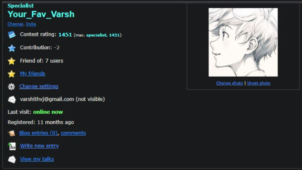
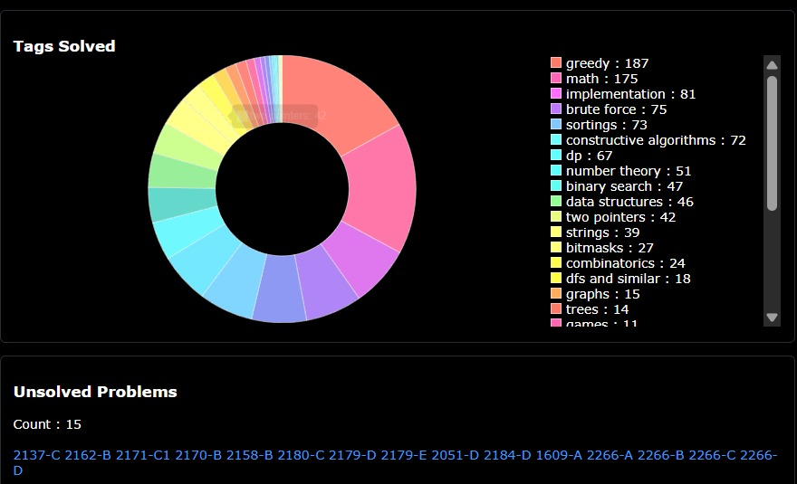
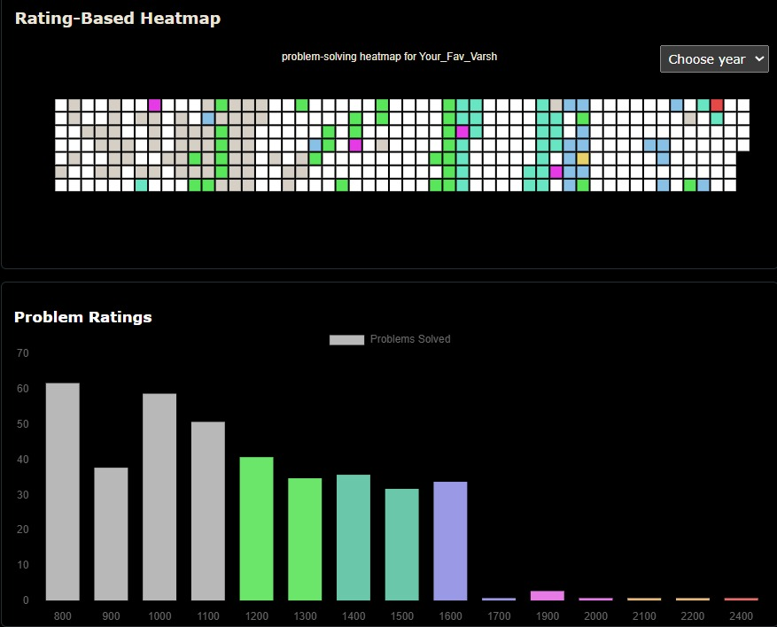
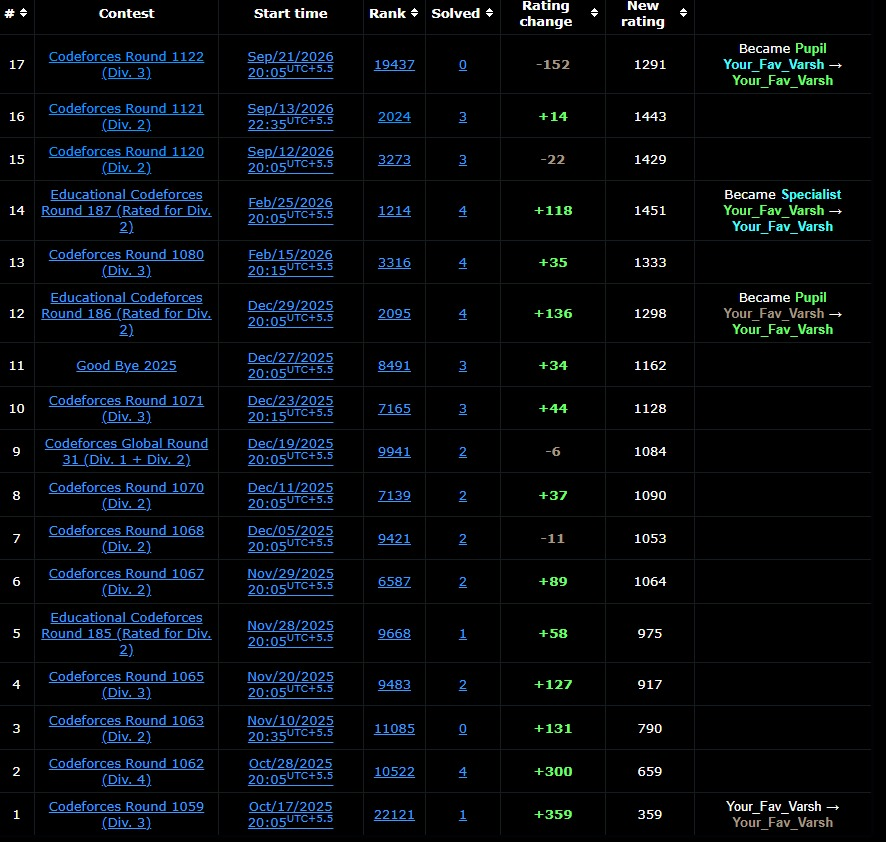

# Competitive Programming & Codeforces Solutions History 🚀

Welcome to my **Competitive Programming (CP) Repository**! 

> [!IMPORTANT]
> 🌟 **MAIN ATTRACTION**: Check out [`LEARNINGS.cpp`](https://github.com/Varshith-24051/CP-History/blob/main/LEARNINGS.cpp)!  
> Ever since my 2nd year, I have been continuously developing this master note capturing everything I've learned during my preparation for **Codeforces** and **ICPC**. I am currently a **Specialist** on Codeforces with a **Max Rating of 1451**. This single file aggregates almost all the algorithmic knowledge, STL tricks, and problem-solving methodologies I have gained from grinding through the **CP-31 sheet** and hundreds of Codeforces problems over the past **~11 months**.

---

## 📊 Problem Solving Statistics & Metrics

I have solved **700+ problems** across various competitive programming platforms:

* 🟢 **Codeforces**: **400+ Problems Solved** | **Max Rating: 1451 (Specialist)**
* 🟡 **LeetCode**: **100+ Problems Solved** (Data Structures, Algorithms & Advanced Topics)
* 🔵 **Other Educational Platforms**: **200+ Problems Solved** (GeeksforGeeks, CodeChef, HackerRank & Educational Portals)

### 📈 Profile Analytics & Performance Showcase

  
    
  
    
  
    
  

---

> [!NOTE]  
> **Private Contests & Problem Setting**: I have conducted numerous private contests and served as a **Problem Setter** for my college contests as well as several private Discord competitive programming groups. A separate folder dedicated to my problem-setting work and problem sets will be added here soon!

---

## 💡 About `LEARNINGS.cpp`

A core highlight of this repository is [`LEARNINGS.cpp`](./LEARNINGS.cpp).

* **What it is**: `LEARNINGS.cpp` is a continuous log of concepts, STL tricks, mathematical shortcuts, bitwise hacks, prefix-sum methods, graph algorithms, and DP patterns accumulated **day-by-day and contest-by-contest** since the very beginning of my CP journey (~11 months).
* **Purpose**: It is **not a newly created file**—it is an old, actively maintained master reference file that I regularly use for revising methodologies, edge cases, and algorithmic templates prior to and during contests.
* **Topics Included**:
  * STL Utilities & Fast I/O (`min_element`, `is_sorted`, `rotate`, `iota`, `exchange`)
  * Bitwise Operations & Hacks (`__builtin_clzll`, Clz optimizations, Bitmask DP)
  * Math & Number Theory (Fast Exponentiation with Modulo, Linear Diophantine Equations, GCD Properties)
  * Array & Prefix Sum Tricks (Left/Right Median calculations, Sliding Window, Coordinate Compression)
  * Graph Theory & Tree Algorithms (2-Coloring DFS, Minimal DSU Structs, Sweep Line Algorithm)
  * Dynamic Programming Patterns & Modulo Optimizations

---

## 📁 Repository Structure

* **Codeforces Problem Solutions**: Solutions categorized by problem index (`A_*.cpp`, `B_*.cpp`, `C_*.cpp`, `D_*.cpp`, `E_*.cpp`, `F_*.cpp`, `G_*.cpp`, `H_*.cpp`).
* **Topic-Specific Files & Folders**:
  * `LEARNINGS.cpp` - Master learning log and cheat sheet.
  * `GRAPHS_LEARNING.cpp` - Graph algorithms & traversal implementations.
  * `DP/` - Dynamic Programming solutions and templates.
  * `DAA_*.cpp` - Design & Analysis of Algorithms course implementations (Fibonacci, Power Calc, Sorting).
  * `BACKUP.cpp` & `AnswerGrader.cpp` - Utility scripts and contest helpers.

---

## 👤 Profiles & Important Note

* **Codeforces Profile**: [Your_Fav_Varsh](https://codeforces.com/profile/Your_Fav_Varsh) (Specialist | Max Rating: 1451)

### ⚠️ Important Note Regarding Profile Status

> [!IMPORTANT]  
> My Codeforces profile (`Your_Fav_Varsh`) is currently temporarily disabled / taken down for a few months due to an **unfortunate misunderstanding during a Div 3 contest**.
> 
> **What Happened**:  
> 1. **Live Team Simulation & Regional Comments**: To replicate the real pressure and intensity of a live contest, my team and I decided to attempt the Div 3 contest live together. For our mutual understanding and fast communication during the session, we typed code comments in regional languages (**Telugu / Tamil**).
> 2. **VS Code Auto-Correct & Tech Transition**: Furthermore, while my teammates primarily code in **Python**, I code in **C++**. We were attempting to help my Python teammates adapt to C++ during the live session, so we mistakenly enabled VS Code auto-correct and auto-formatting extensions to assist with syntax. This automated formatting generated repetitive code patterns that, combined with non-English comments, inadvertently triggered Codeforces' automated similarity detection bot, resulting in a temporary flag and account restriction for a few months.
> 
> **Integrity Statement**:  
> I want to state with 100% clarity and conviction that **I have nowhere carried out any plagiarism, code sharing, or AI-assisted cheating in my entire coding history**. Every solution, logic, and learning in this repository reflects genuine effort, independent problem-solving, and continuous improvement.

---

*Maintained by [Varshith-24051](https://github.com/Varshith-24051)*
